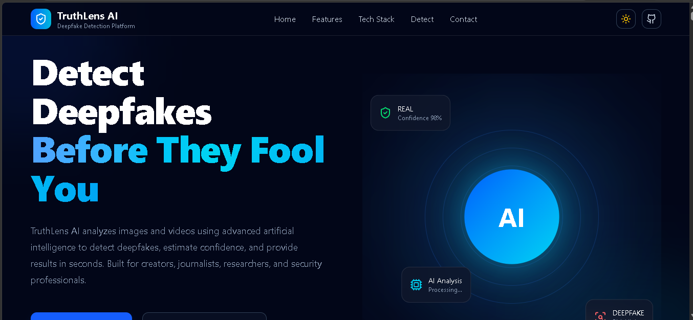
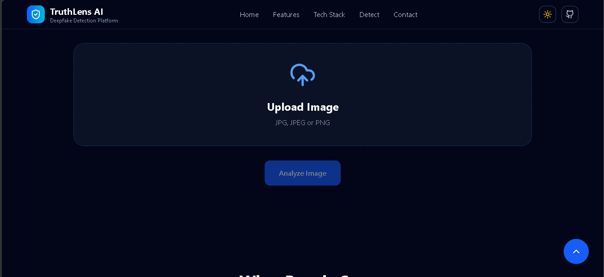
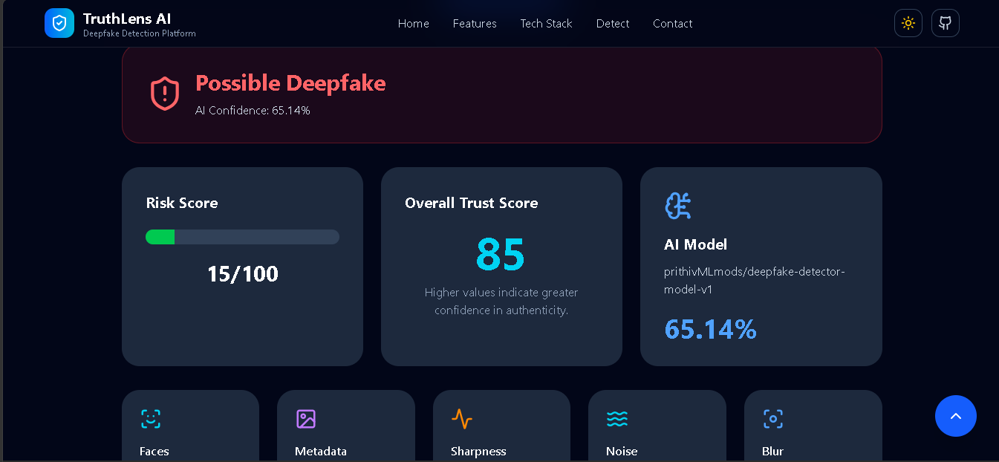

  

<h1 align="center">TruthLens AI</h1>

AI-Powered Media Authenticity Platform

Detect • Analyze • Verify AI-Generated Images

  <a href="https://truthlens-ai-jet.vercel.app"><strong>🌐 Live Demo</strong></a> •
  <a href="https://github.com/aryansingh192005/truthlens-ai"><strong>📂 Repository</strong></a>

---

## 📖 Overview

TruthLens AI is an AI-powered media authenticity platform designed to identify AI-generated and manipulated images. It combines a modern React frontend, a FastAPI backend, and a deep learning model built with PyTorch and EfficientNet to deliver fast and reliable predictions.

The platform is designed with simplicity in mind, allowing users to upload an image and receive an authenticity prediction with a confidence score in just a few seconds.

---

## ✨ Features

- 🧠 AI-powered deepfake detection
- ⚡ Fast image analysis
- 📊 Confidence score prediction
- 🎨 Modern responsive interface
- 🌙 Dark & Light mode
- 📱 Mobile-friendly design
- ☁️ Deployed on Vercel & Railway

---

## 🛠️ Tech Stack

| Category | Technologies |
|----------|--------------|
| **Frontend** | React, Vite, HTML5, CSS3, JavaScript |
| **Backend** | FastAPI, Python |
| **AI / ML** | PyTorch, EfficientNet |
| **Deployment** | Vercel, Railway |
| **Tools** | Git, GitHub |

---

## 📸 Screenshots

### 🏠 Home Page

---

### 📤 Upload Interface

---

### 📊 Detection Result

---

### 📱 Mobile View

---

## ⚙️ How It Works

1. Upload an image through the web interface.
2. The image is securely sent to the FastAPI backend.
3. The backend preprocesses the image for inference.
4. The EfficientNet model analyzes the uploaded image.
5. The model predicts whether the image is **Real** or **AI-Generated**.
6. The prediction and confidence score are displayed to the user instantly.

---

## 🚀 Future Improvements

- 🎥 Video deepfake detection
- 🎙️ Audio deepfake detection
- 📈 Model performance dashboard
- 🔥 Explainable AI (Grad-CAM)
- 👥 User authentication
- 📂 Batch image analysis
- 🌐 REST API for third-party integration

---

## 👨‍💻 Author

**Aryan Singh**

B.Tech Computer Science Engineering

If you found this project helpful, consider giving it a ⭐ on GitHub.

---
